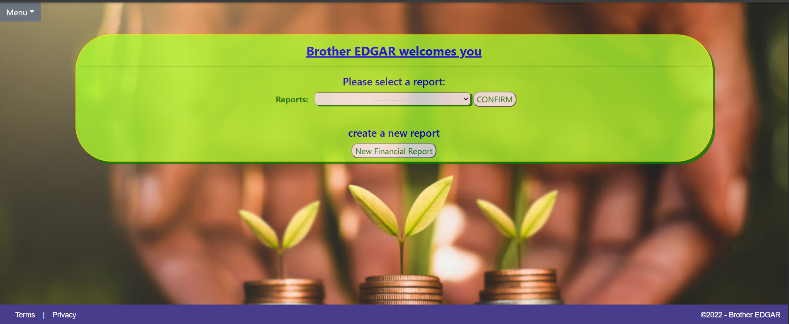
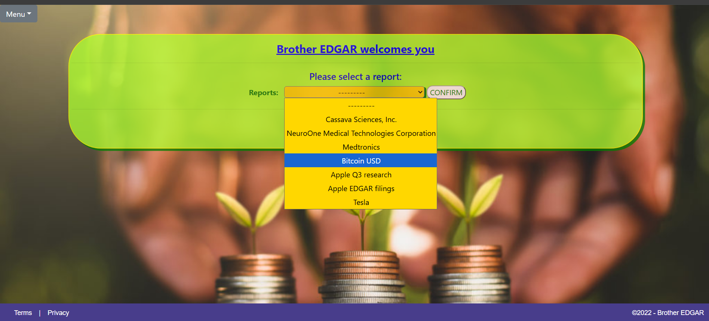
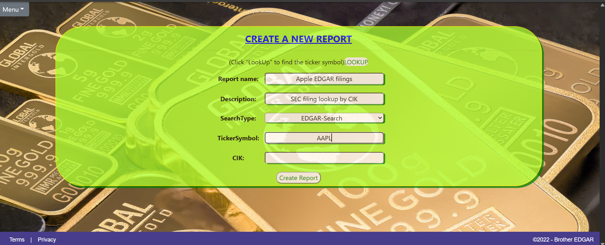
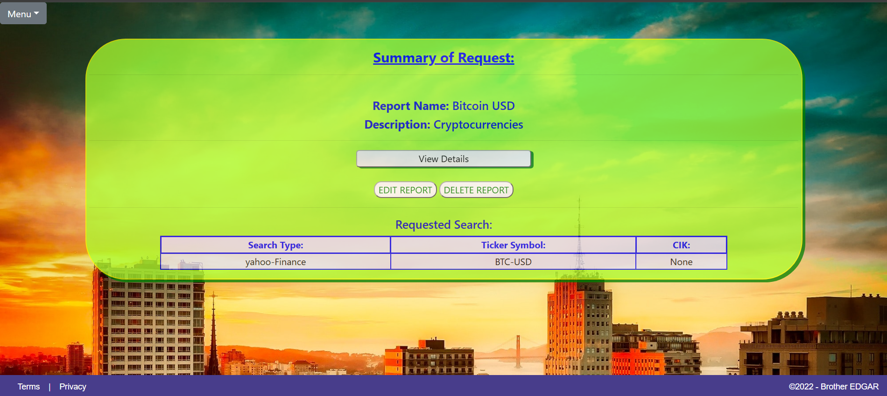
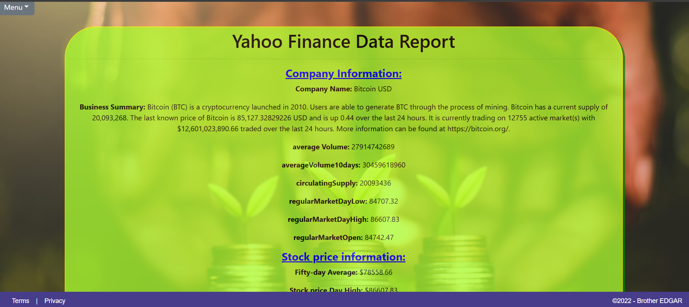
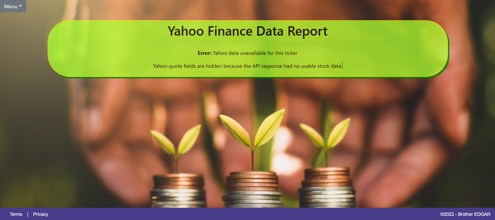
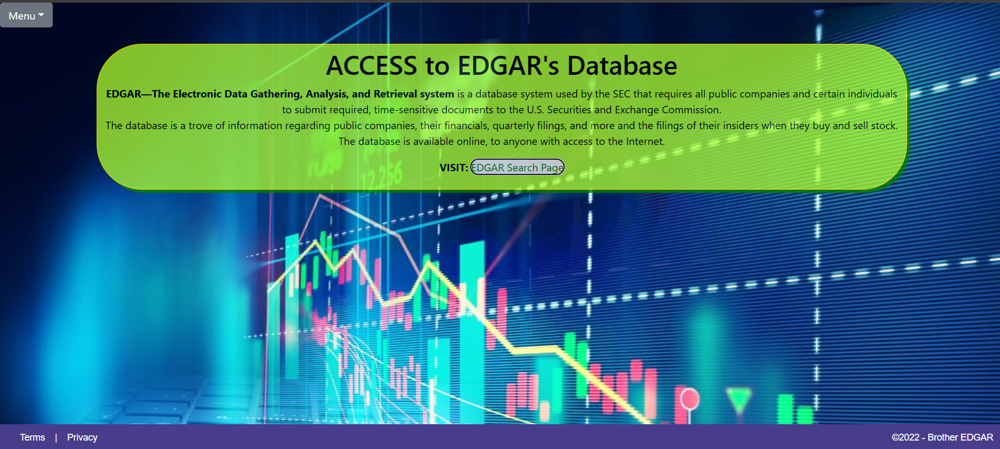
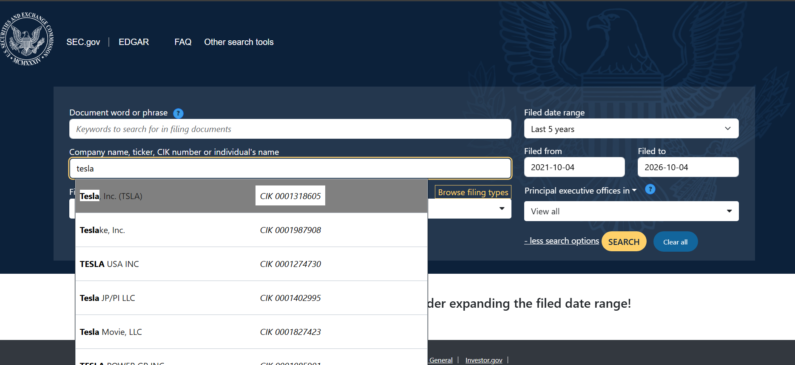
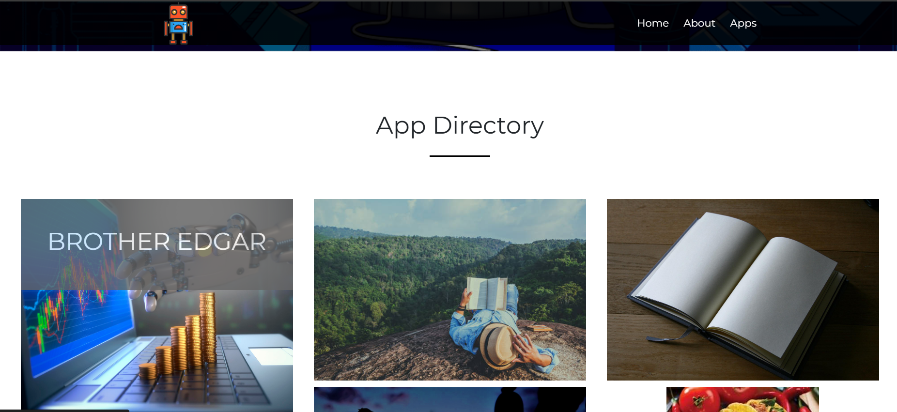

# Brother EDGAR — Financial Research App (AppBuilder9000)

Django app inside the Tech Academy **AppBuilder9000** live project. **Brother EDGAR** lets you save financial research reports (ticker, search type, notes) with full CRUD, then pull live market context from Yahoo Finance–style data and (optionally) SEC EDGAR-style search flows — named after the SEC’s EDGAR filing system.

**My role:** On the live-project team I owned the **Brother EDGAR** app end-to-end — Django model + forms, create / display / update / delete with delete confirmation, home dropdown to open a saved report, and market-data integration that requests quote info by ticker and renders selected fields on the results page.

> **Live demo:** _coming soon (Render / Railway / PythonAnywhere after secrets scrub)_

## Screenshots

Home — welcome and open a saved report:



Home — select a report from the dropdown:



Create — new research report form:



Report summary — search type, ticker, and actions:



Yahoo Finance results — live quote fields (example: BTC-USD):



Yahoo Finance — defensive error when quote data is unavailable:



EDGAR path — in-app explainer and link to SEC EDGAR:



Official SEC EDGAR search (opened from the in-app link; example: Tesla):



## Tech stack

| Layer | Tools |
| --- | --- |
| Language | Python |
| Web | Django (AppBuilder9000 multi-app project) |
| Data | SQLite (dev) / Django ORM |
| Market data | `yfinance` (primary); course originally used Yahoo Finance via RapidAPI |
| IDE | PyCharm Community Edition |
| Front end | Django templates + forms |


## What I built (features)

- **Brother EDGAR Django app** — New app wired into AppBuilder9000 with a home page and navigation into the research workflow.
- **Report model + create** — Persist research reports (ticker symbol, search type, description, optional CIK) through a validated model form.
- **Index / display / details** — Browse saved reports from a home dropdown and open a single report by primary key.
- **Update + delete with confirmation** — Edit a report in place; delete only after an explicit confirm step.
- **Yahoo quote page + defensive UI** — For `yahoo-Finance` reports, fetch quote data by ticker, map useful fields into the template, hide empty fields, and show a clear error when the feed returns no usable data.
- **EDGAR search handoff** — For `EDGAR-Search` reports, show a short explainer of SEC EDGAR and link to the official EDGAR search page so the user can look up filings by company, ticker, or CIK.

## Code highlight

From `Brother_EDGAR/views.py` — pull quote data with `yfinance`, guard empty responses, then map fields with `.get(...)` so missing keys do not crash the page:

```python
ticker = yf.Ticker(symbol)
data = ticker.info or {}

if not data or not data.get("shortName"):
    return render(request, 'Brother_EDGAR/BrotherEDGAR_yahooFinance.html', {
        'form': form,
        'item': item,
        'error': 'Yahoo data unavailable for this ticker',
    })

company_name = data.get("shortName", "")
business_summary = data.get("longBusinessSummary") or data.get("description")
averageVolume = data.get("averageVolume")
averageVolume10days = data.get("averageVolume10days") or data.get("averageDailyVolume10Day")
fiftyDayAverage = data.get("fiftyDayAverage")
dayHigh = data.get("dayHigh")
dayLow = data.get("dayLow")
# ... additional .get(...) fields for the template ...
```

**Why it mattered:** The useful product isn’t a raw dump — it’s selecting fields a researcher cares about, surviving schema gaps, and failing loudly (not with a 500) when the upstream feed blocks or has no quote for that symbol.

## Project layout (my slice)

```
AppBuilder9000/
  manage.py
  Brother_EDGAR/
    models.py
    forms.py
    views.py
    urls.py
    templates/Brother_EDGAR/   (home, create, display, update, delete, yahooFinance, searchPage)
```

Other hobby apps under AppBuilder9000 were owned by teammates.

## Team context

Built as part of a multi-developer Tech Academy live project. I focused on Brother EDGAR; the wider AppBuilder9000 site hosts many teammate apps. Work followed sprint stories in the course board.

AppBuilder9000 App Directory — select **Brother EDGAR** among the other apps:



## What I learned

- **Third-party APIs can vanish:** The course RapidAPI Yahoo host eventually returned `API doesn't exists`. Always check status/body before indexing nested keys.
- **Prefer a durable data path when the marketplace listing dies:** Switching the Yahoo page to `yfinance` removed the RapidAPI middleman for local demos (still unofficial; Yahoo can 401).
- **JSON / field drift:** Alternate keys (`longBusinessSummary` vs `description`, `averageDailyVolume10Day`, etc.) and template `` checks keep blank rows off the page.
- **When not to scrape:** For regulated filing search, linking to official SEC EDGAR is clearer and more maintainable than re-implementing their search UI.
- **One clean app in a shared Django project:** Clear URLconfs and templates so Brother EDGAR does not collide with teammate apps inside AppBuilder9000.

## How to run locally

1. **Prerequisites:** Python 3.x, `pip`, virtualenv; **PyCharm** recommended for this project.
2. Open `.../Python-LiveProject/AppBuilder9000`.
3. Create/activate a venv; `pip install -r requirements.txt` and `pip install yfinance` if needed.
4. `python manage.py migrate` then `python manage.py runserver 127.0.0.1:8000`.
5. Open Brother EDGAR from the AppBuilder9000 home (e.g. `/Brother_EDGAR/home/`).
6. If live Yahoo quotes fail with crumb / unauthorized errors, try disconnecting VPN — that restored quotes in local testing.

`127.0.0.1:8000` is localhost + Django’s common default port — change the port if something else already owns `8000`.

